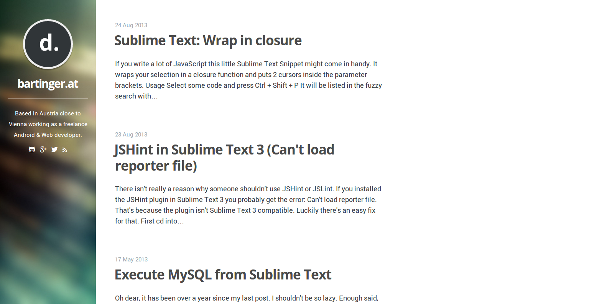
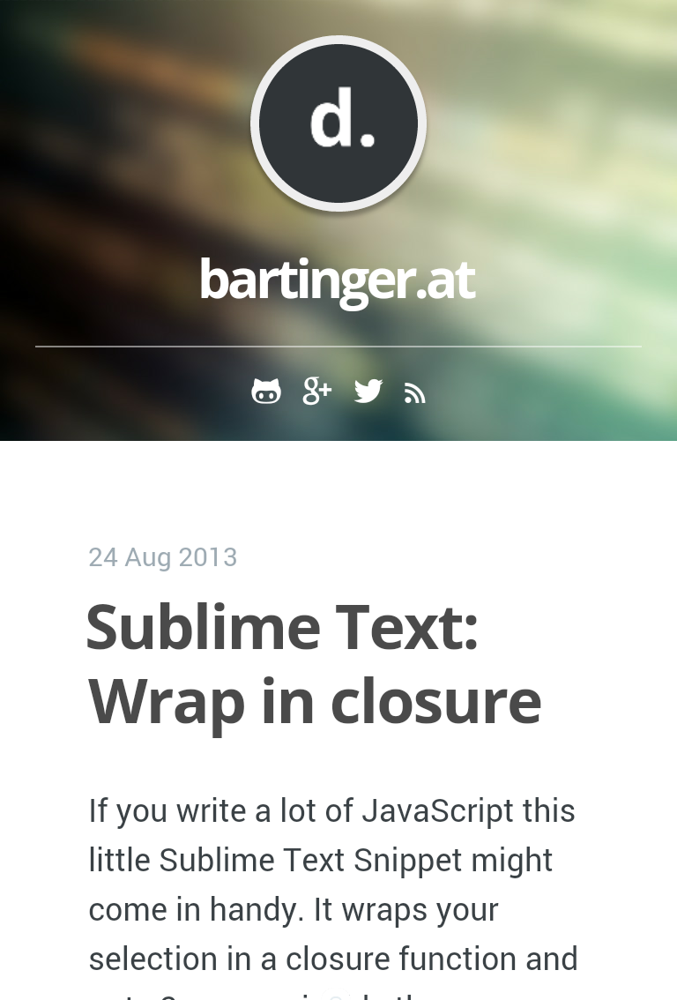

# Phantom

Phantom is a simple and responsive theme for [Ghost](http://github.com/tryghost/ghost/). It's compatible with ```Ghost Aton (0.4.*)```.

Take a look at the live demo at: [http://bartinger.at](http://bartinger.at)

If you're using Phantom as your theme I would love to see it. Drop me the URL at [here](https://plus.google.com/+DominicBartl) or send me a [mail](mailto:dominic.bartl.at@gmail.com)

## Features
- Minimalistic responsive
- Google Analytics
- Disqus comments
- Icon-font ([Fontello](/assets/fonts/config.json))

## SEO
- Post tags as meta keywords

## Development
- Grunt
- Sass
- CSS minification
- Deployment via rsync

Using [Grunt](http://gruntjs.com) for development run ```gunt dev``` which watches the directory and does the ```sass``` compiling. *Note: Livereload extension must be installed, for it to work. I didn't include the connect middleware*.

To package the theme run ```grunt build``` and publish the new generated ```dist``` directory in your ghost theme directory. Run ```grunt compile``` to package the theme in the standalone directory.

## Grunt What?
Even though I highly recommend using Grunt, if you dont't know what it is and don't want to learn it (as a web developer you definitely should) you can use the standalone version. Take the ```standalone``` directory and copy it to your theme directory. It contains the whole theme with unminified css, ready for you to be edited.

This theme is based on the default theme casper.




## Copyright & License

Copyright (C) 2014 Dominic Bartl - Released under the MIT License.

Permission is hereby granted, free of charge, to any person obtaining a copy of this software and associated documentation files (the "Software"), to deal in the Software without restriction, including without limitation the rights to use, copy, modify, merge, publish, distribute, sublicense, and/or sell copies of the Software, and to permit persons to whom the Software is furnished to do so, subject to the following conditions:

The above copyright notice and this permission notice shall be included in all copies or substantial portions of the Software.

THE SOFTWARE IS PROVIDED "AS IS", WITHOUT WARRANTY OF ANY KIND, EXPRESS OR IMPLIED, INCLUDING BUT NOT LIMITED TO THE WARRANTIES OF MERCHANTABILITY, FITNESS FOR A PARTICULAR PURPOSE AND
NONINFRINGEMENT. IN NO EVENT SHALL THE AUTHORS OR COPYRIGHT HOLDERS BE LIABLE FOR ANY CLAIM, DAMAGES OR OTHER LIABILITY, WHETHER IN AN ACTION OF CONTRACT, TORT OR OTHERWISE, ARISING FROM, OUT OF OR IN CONNECTION WITH THE SOFTWARE OR THE USE OR OTHER DEALINGS IN THE SOFTWARE.
